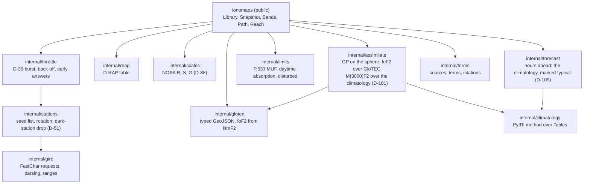

# Design

The public shape is in watchpost's architecture document
(`watchpost/06_docs/02_features/propagation-overlays/03-architecture-design/architecture.md`, "go-ionomaps'
shape"). This page holds the library's inside: its packages, its update, and **where every algorithm comes
from** (watchpost D-53).

## Packages



## One update

1. **Throttle** (R-5.3, R-5.4): within the hour's budget? If not, answer from the last good snapshot, with its age and the reason.
2. **Stations** (R-5.5): the live list, rotation and one probe, never more than 40 requests together (D-87).
3. **Fetch**, through the host's fetcher (R-5.1):
   - GIRO readings since the last held (R-5.2);
   - GloTEC's newest grid (validators, so a 304 when unchanged);
   - D-RAP;
   - NOAA's space-weather scales (D-88);
   - NOAA's daily solar indices, at most once a day (watchpost D-104).

   A 429 stops the update and starts the back-off.
4. **Parse and check** (R-3.3, R-3.4): header lines dropped; every value range-checked; rejects counted.
5. **Background:**
   - foF2: GloTEC's, from NmF2 (else the climatology's, named);
   - M(3000)F2: the climatology's (watchpost D-101);
   - else the climatology (named, FR-5.2).
6. **Assimilate** (R-9.2): station residuals for foF2 (over GloTEC) and M(3000)F2 (over the climatology), a GP on the sphere each, added to its background.
7. **Hours ahead** (R-1.3, watchpost D-109): each hour ahead is the climatology's hour from the day's cache, marked typical, with the typical error and its basis.
8. **Snapshot:** fields, valid and computed times, sources, background, age.

The answers (`Bands`, `Path`, `Reach`) are pure functions of a snapshot (R-2), so a host can call them off
its UI goroutine without touching the network.

## Provenance (watchpost D-53)

`arodland/prop` is never opened. Each component's source is below, and each exported function cites its
source in its doc comment (R-7.1).

| Component | Method | Source |
|---|---|---|
| foF2 from NmF2 | f = 8.98×10⁻⁶ √N (plasma frequency) | standard ionospheric physics; ITU-R P.1239 |
| Climatology | spherical-harmonic and Fourier evaluation of foF2 and M(3000)F2 for a month, solar level and hour | **PyIRI (MIT, ported)**, `sh_library.py`; Forsythe et al. 2024 (doi:10.1029/2023SW003739); the NRL refits (D-43) |
| Magnetic coordinates | IGRF-14 field, field lines traced to the apex; quasi-dipole latitude from the apex height; MLT from the subsolar point's quasi-dipole longitude; generated at build time | IAGA IGRF-14 (its release paper, cited in BUILD); Richmond 1995 (J. Geomag. Geoelectr. 47, 191-212); Laundal & Richmond 2017 (Space Sci. Rev.); checked against PyIRI's `Apex.nc` (MIT) (watchpost D-107) |
| Sunspot scale | SILSO v2 to the v1 scale (k = 0.6); foF2 capped at R12 = 160 | ITU-R P.1239-4; Lockwood et al. 2016 |
| Assimilation | Gaussian-process regression of station residuals; exponential kernel in great-circle distance | Rasmussen & Williams 2006; Gneiting 2013 (doi:10.3150/12-BEJSP06); validated against Galkin et al. 2012 (IRTAM, doi:10.1029/2011RS004952) |
| Hours ahead | the climatology for each hour, marked typical; its error measured on PLAN's week | watchpost D-109; `02-analysis/evidence/week.py` |
| MUF for a path | basic MUF from foF2, M(3000)F2 and distance | ITU-R P.533-14 §3.4-3.5, equations checked against the recommendation's worked values (R-2.7) |
| Daytime absorption | absorption against solar zenith angle, frequency and solar activity, for the reference circuit | ITU-R P.533-14 (its absorption term); the method only, no text or tables |
| Disturbance | D-RAP's 1 dB frequency; below it, "disturbed" | NOAA SWPC D-RAP (public domain) |
| Space-weather scales | NOAA's R, S and G levels and outlook, carried as published; named, not modelled (D-88) | NOAA SWPC scales feed (public domain) |
| Reach | the area where a frequency lies between the limits along paths from an origin; the skip zone where the sky wave first returns | geometry over the path model above |

## Tables (the seam, D-43)

```go
type Tables interface {
    FoF2(month int, solar Level) Coefficients
    M3000(month int, solar Level) Coefficients
}
```

The shipped implementation reads NRL's refits, converted at build time into a compact Go-readable form. A
test runs the climatology on supplied tables (R-4.4), so the refits can be replaced.

## What the dry run decides here

- the kernel length and noise;
- the hours ahead's typical error (watchpost D-109);
- the near-vertical radius: the host's to give (watchpost D-100: 400 km by default, a Setting);
- the F10.7 rule;
- the refits' accuracy against PyIRI's raw CCIR tables.

Each is recorded in watchpost's `07-readiness/dry-run.md` and ruled where it sets a target (watchpost D-49).
